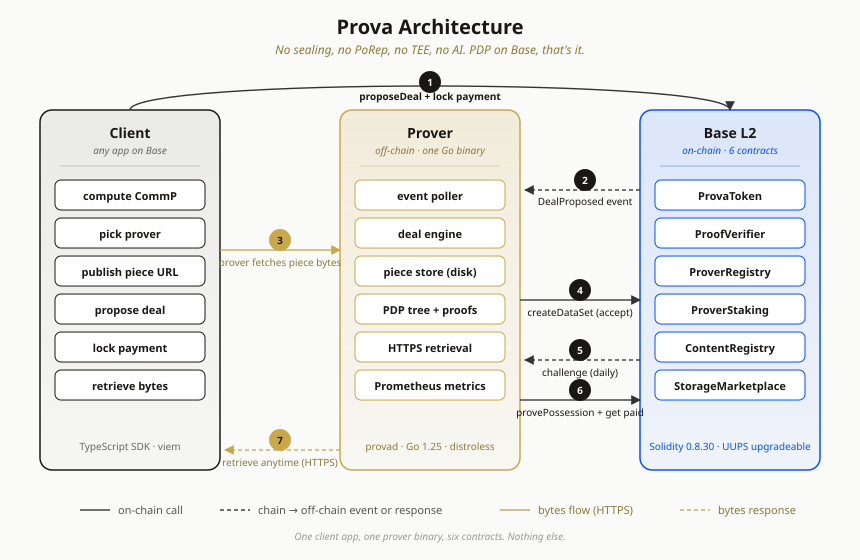
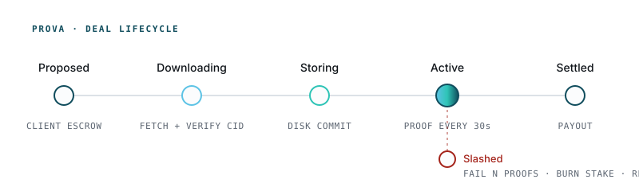

<div align="center">
  

  <h1>Prova</h1>

  <p><strong>Verifiable storage on Base.</strong> Upload a piece, pay in ETH, and get continuous on-chain proofs that your data is actually there.</p>

  <p>
    <a href="#install"></a>
    <a href="https://base.org"></a>
    <a href="https://github.com/prova-network/prova/actions/workflows/ci.yml"></a>
    <a href="./spec/"></a>
    <a href="./LICENSE"></a>
    <a href="./PIVOT.md"></a>
  </p>
</div>

---

Prova is a thin, honest slice of storage technology. It takes the parts of the Filecoin ecosystem that are lightweight and have been proven at scale (PDP, CommP, the FoC marketplace pattern) and runs them on Base. No sealing. No SNARKs. No AI. No separate chain. Just verifiable, retrievable storage, priced in ETH, backed by prover stake.

> **Upload a piece.** Prover picks it up from your URL and stores the bytes.<br>
> **Wait 30 seconds.** The deal lands on Base and the prover starts getting challenged on-chain every day.<br>
> **Retrieve any time.** Pull the bytes back over HTTPS, verified against the CommP you computed yourself.

---

## Why Prova

Most storage projects compete on cryptographic ambition. Prova wins by doing the opposite.

- 📦 **One storage primitive, done well.** Provable Data Possession, nothing else.
- ⚡ **Cheap on-chain cost.** Merkle inclusion proofs verify in O(log N) gas on Base. About $0.001 per proof.
- 🔐 **Honest economics.** Provers stake PROVA, clients lock ETH, fees stream in 1% to treasury, 99% to the prover. Fail to prove and you get slashed, no nuance.
- 🌐 **Base-native.** ETH for gas, USDC for stable pricing, ENS for naming, the existing Ethereum tooling. No new chain to learn.
- 🧰 **Single Go binary.** `provad` runs the whole prover. Systemd unit, Prometheus metrics, hardened Docker image, SIGTERM graceful shutdown. Boring on purpose.
- 🤝 **Standing on Filecoin's shoulders, not competing with them.** PDP is MIT-licensed, so is the CommP stack. We credit the origins and we keep the math.

---

## Architecture

<div align="center">
  
</div>

Three actors: **client**, **prover** (off-chain), **Base** (on-chain). Client computes CommP from the bytes, picks a prover, calls `StorageMarketplace.proposeDeal` on Base with payment locked up. Prover sees the event, pulls the bytes from the client's URL, recomputes CommP, stores the piece, and calls `ProofVerifier.createDataSet` to accept. After that, Base challenges the prover periodically and the prover submits Merkle inclusion proofs. Each successful proof releases a slice of the client's locked payment.

Every step is a standard EVM transaction. The whole thing is 6 Solidity contracts and one Go binary.

---

## Deal lifecycle

<div align="center">
  
</div>

The prover advances deals through four intermediate states (Proposed → Downloading → Verifying → Accepting) before handing off to the chain, which owns the terminal transitions (Active → Completed, or Slashed if a proof is missed past `MAX_PROOF_GAP`).

---

## Install

When the first public release lands, the prover will install with:

```bash
curl -fsSL https://get.prova.network | bash
```

Detects your platform (linux or darwin, amd64 or arm64), verifies the SHA-256 checksum of the release tarball against the published `checksums.txt`, drops the binary into `/usr/local/bin/provad`, writes an example config, and on Linux offers to install a hardened systemd unit.

**Supported systems:**

- **Linux:** Ubuntu 22.04+, Debian 12+, Fedora 39+, anything with systemd 249+
- **macOS:** 13 (Ventura) or newer
- **Arches:** amd64, arm64
- **Windows:** not supported natively (use WSL2 at your own risk)

**Host dependencies** (already present on every modern Linux/macOS): `bash`, `curl`, `tar`, `install`, `sha256sum` (or `shasum` on macOS), and `sudo` + `systemctl` if you opt into the Linux service unit. The Prova binary itself is statically compiled; no Go, libssl, or glibc compatibility surprises.

**Env var overrides:**

```bash
PROVA_VERSION=v0.1.0          # pin a specific release (default: latest)
PROVA_PREFIX=$HOME/.local     # user-local install instead of /usr/local
PROVA_CONFIG=/etc/prova       # where to drop prover.toml.example
PROVA_NO_SYSTEMD=1            # skip systemd unit setup on Linux
PROVA_DRY_RUN=1               # print what would happen, don't do it
PROVA_YES=1                   # answer yes to all prompts, for CI
```

The source is [`install.sh`](./install.sh), intentionally readable. Pair with [`uninstall.sh`](./uninstall.sh) to remove.

---

## For humans

Five short guides cover the common "how do I actually use this?" questions:

- **[Quickstart](./docs/QUICKSTART.md)**: from `git clone` to a running prover with dashboard in 10 minutes on your laptop
- **[Running a prover](./docs/RUNNING-A-PROVER.md)**: hardware SKUs, staking, rewards, what happens if you stop, uninstall, everything a new prover operator needs
- **[Building on Prova](./docs/BUILDING-ON-PROVA.md)**: how devs store files, host `.eth` websites, and build platforms on top
- **[What it looks like on-chain](./docs/ONCHAIN.md)**: six contracts explained, money flows, Basescan events, indexer guide
- **[Specs](./spec/)**: the canonical protocol specification for deep implementers

---

## Status

**Phase A to H plus post-phase hardening: done.** See [`prover/ROADMAP.md`](./prover/ROADMAP.md) for the per-phase history.

| | |
|---|---|
| Solidity contracts | 6 contracts, 14 tests passing, UUPS upgrade path for the verifier |
| Go prover | 13 packages, 89 tests passing, end-to-end validated against local anvil |
| One-line install | `install.sh` ready, pending first tagged release |
| CI | Foundry + Go + shellcheck on every push |
| Release | GitHub Actions builds linux/darwin x amd64/arm64 tarballs on every `v*` tag |
| Base Sepolia deploy | Gated on author's exit from existing engagements, target mid-2026 |
| Points program | Ready to launch with public testnet |
| TGE | Usage-triggered, not calendar-triggered. See [`TOKENOMICS-v2.md`](./TOKENOMICS-v2.md) |

---

## Repository layout

```
contracts/                Solidity contracts (Base-compatible)
  src/                    ProofVerifier, registry, staking, marketplace
  script/Deploy.s.sol     Foundry deploy script
  test/                   Foundry tests (Integration, ProvaToken)

prover/                   Go prover daemon (one binary)
  cmd/provad/             Daemon + CLI entry point
  pkg/                    deal lifecycle, challenges, httpserver, metrics,
                          pdptree, piece, wallet, ethclient, config, store
  internal/soaktest/      End-to-end integration scenario on anvil
  deploy/provad.service   Hardened systemd unit
  Dockerfile              Multi-stage, distroless/nonroot

sdk/typescript/           TypeScript client SDK (forked from synapse-sdk)
  core/                   @prova-network/core
  sdk/                    @prova-network/sdk

spec/                     v2 protocol specifications
brand/                    Logo + architecture diagrams
website/                  Public-facing website source
install.sh, uninstall.sh  One-liner installer and its companion
archive/                  Pre-pivot v1 code + docs, preserved for history
```

---

## Building locally

```bash
# Contracts
cd contracts
forge build
forge test

# Prover
cd ../prover
go build ./cmd/provad
go test ./...

# Full end-to-end against anvil
cd internal/soaktest
./run.sh
```

The soak test spins up anvil, deploys the whole contract set, registers a prover, proposes 3 deals from 3 clients, starts `provad`, waits for all 3 deals to reach `Active`, asserts the metrics, and shuts down cleanly. Runs in about 10 seconds.

---

## Specs

The [`spec/`](./spec/) directory has the authoritative v2 protocol specifications:

- [PDP integration](./spec/pdp-integration.md) (the only storage proof Prova uses)
- [Marketplace](./spec/marketplace.md) (deal lifecycle and settlement)
- [Checkpoint anchoring](./spec/checkpoint-anchoring.md)
- [Data availability](./spec/data-availability.md)
- [Security threat model](./spec/security-threat-model.md) and [audit checklist](./spec/security-audit-checklist.md)

Higher-level project docs at the repo root:

- [`PROVA-V2-ARCHITECTURE.md`](./PROVA-V2-ARCHITECTURE.md), the architecture spec
- [`TOKENOMICS-v2.md`](./TOKENOMICS-v2.md), the token model (points first, usage-triggered TGE)
- [`PIVOT.md`](./PIVOT.md), the confidentiality constraint and v1 to v2 pivot summary

---

## Credits

Prova stands on years of storage-proof research by the Filecoin community. PDP, CommP, Fr32 padding, SHA-254 Merkle trees, piece-commitment CIDs; all originated there. Prova ports those primitives onto Base as a coexistent network.

Key upstreams:

- [`FilOzone/pdp`](https://github.com/FilOzone/pdp) for the on-chain verifier contracts
- [`FilOzone/synapse-sdk`](https://github.com/FilOzone/synapse-sdk) for the TypeScript client SDK
- [`filecoin-project/curio`](https://github.com/filecoin-project/curio) for the PDP engine and piece CID machinery
- [`filecoin-project/lotus`](https://github.com/filecoin-project/lotus) for FR32 padding

Per-file attribution lives in SPDX headers and per-directory `ATTRIBUTION.md`.

---

## License

MIT for original Prova work. Portions derived from upstream projects under Apache-2.0 OR MIT, with attribution preserved per file and in [`LICENSE`](./LICENSE).

---

<div align="center">
  <sub>Built slowly, shipped quietly, verified cryptographically.</sub>
</div>
