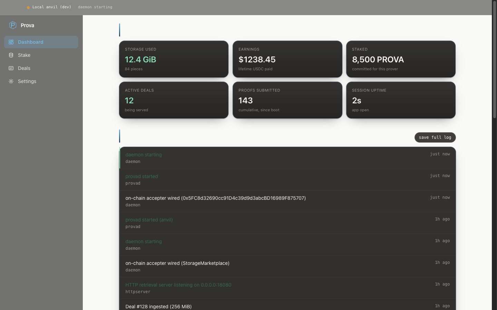
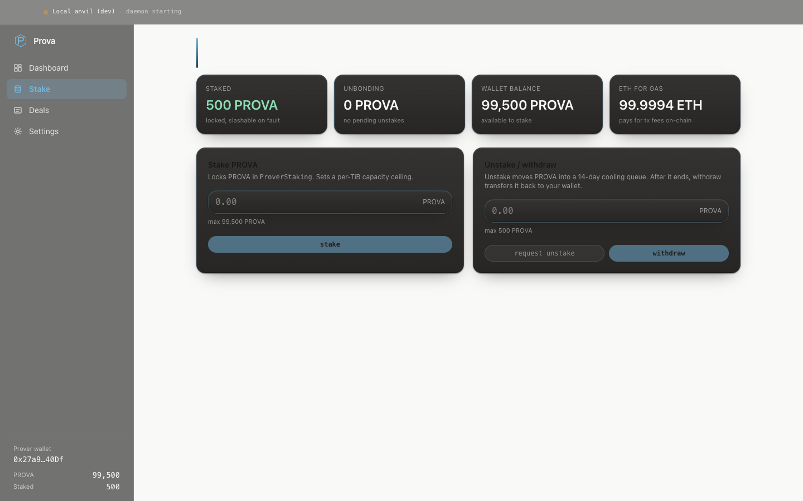
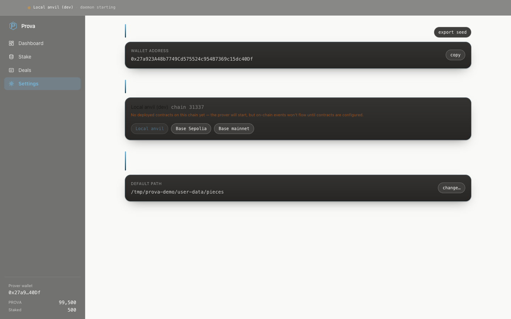
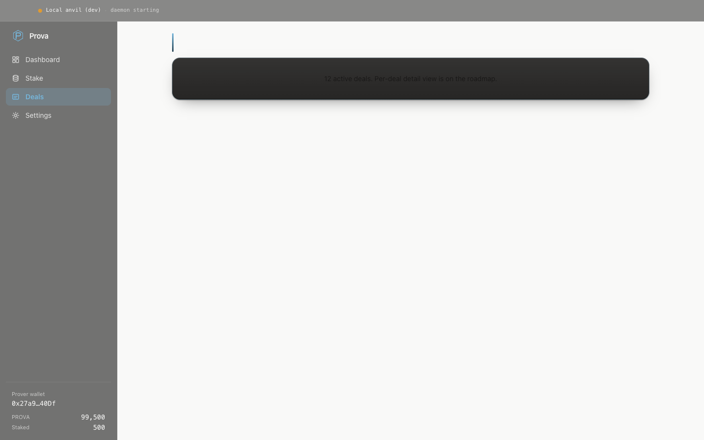

<div align="center">


# Prova Helm

**The operator console for running a Prova prover.**
Local wallet, on-chain stake / unstake / withdraw, daemon supervisor, auto-update.

</div>

---

Prova Helm wraps the headless `provad` daemon in a friendly desktop shell. It's the shortest path from "I have a workstation in the closet" to "I'm running a prover and earning."

- Drop-in install — no JSON to edit, no systemd unit to write
- BIP-39 wallet generated on first launch and stored in your OS keychain
- One click from `register prover` → `stake PROVA` → live deals
- Picks Base mainnet, Base Sepolia, or a local anvil devnet via a network selector
- Auto-update against signed GitHub releases
- All on-chain transactions sign locally; no key ever leaves the keychain

> Status: **early access.** Functional end-to-end against a local anvil devnet with the contract suite deployed. Base Sepolia + Base mainnet contract addresses are pending [`prova-network/prova#1`](https://github.com/prova-network/prova/issues/1).

---

## Screenshots

### Dashboard

The home view: storage used, earnings, staked, active deals, proofs submitted, plus a live activity feed coming straight from the daemon's structured log.



### Stake

Stake / unstake / withdraw against `ProverStaking`. Approves the staking contract automatically before staking. Shows your live PROVA + ETH balances, current staked amount, and any in-flight unbonding queue with a countdown.



### Settings

Wallet (export seed, copy address), Network (anvil / Base Sepolia / Base mainnet preset selector), Storage (folder / drive picker, including external drives).



### Deals

Per-deal detail view is on the roadmap. The dashboard already shows live counters; this tab will get a row-per-deal table with payout schedule + proof history once the dealing flow lands on testnet.



---

## Install

Pre-built signed releases ship through GitHub:

```bash
curl -sSL https://prova.network/get | sh
```

Or download a `.dmg` / `.exe` / `.AppImage` from the [releases page](https://github.com/prova-network/desktop/releases).

---

## Develop

```bash
# 1. Build the provad binary that the app will spawn.
cd prover
go build -o provad ./cmd/provad

# 2. Install desktop deps + run in dev mode.
cd ../desktop
npm install
npm start
```

Useful environment flags:

| Variable | What it does |
| --- | --- |
| `PROVA_ROOT` | Override per-platform `userData` path. Useful for running multiple isolated instances or wiping state for a clean first-run flow. |
| `PROVA_DISABLE_DAEMON=1` | Skip provad spawn entirely. The UI comes up against a stubbed daemon — handy for visual iteration without a running chain. |
| `PROVA_DEMO=1` | Seed plausible fake activity + counters so the dashboard tells a realistic story. Used for marketing screenshots; leave unset for real prover ops. |
| `PROVA_CAPTURE_SCREENSHOTS=1` | Cycle through every tab and write a PNG of each to `./screenshots/`. One-shot mode; the app quits when done. Combine with `PROVA_DEMO=1`. |

The packaged release lives at `dist/`:

```bash
npm run package
```

Builds `dist/Prova Helm-<ver>-universal.dmg`, `Prova Helm-<ver>-x64.exe`, and `Prova Helm-<ver>-x86_64.AppImage`. The `provad` binary is bundled under `resources/provad/`.

---

## Architecture

```
┌────────────────────── Prova Helm (Electron) ───────────────────────┐
│                                                                    │
│  ┌──────────────┐    IPC    ┌───────────────┐    spawn  ┌────────┐ │
│  │ Renderer     │ ◀───────▶ │  Main process │ ────────▶ │ provad │ │
│  │ (React+Vite) │           │ (Node + ethers)│           │  (Go)  │ │
│  └──────────────┘           └───────────────┘           └────────┘ │
│                                  │                          │      │
│                                  │                          │      │
│                                  ▼                          ▼      │
│                          OS keychain (BIP-39)        Base RPC       │
│                                                                    │
└────────────────────────────────────────────────────────────────────┘
```

- **Renderer** (`renderer/`) is a React 19 + Tailwind SPA, built with Vite. No keys, no chain, no daemon access — every privileged call goes through the preload `electron` bridge.
- **Main** (`main/`) owns the wallet (`wallet.js`), the daemon supervisor (`provad.js`), the on-chain bridge (`chain.js`), and persistent settings (`prova-config.js`). All IPC handlers live in `ipc.js` with their channels namespaced `prova:*`.
- **provad** is the Go prover daemon shipped as a sidecar binary. The supervisor restarts it on crash with exponential backoff, parses its slog JSON output into the activity feed, and surfaces the latest stderr line in the failure banner.

---

## Provenance

Forked from [CheckerNetwork/desktop](https://github.com/CheckerNetwork/desktop) (originally `filecoin-station/desktop`), archived upstream in 2025. License: Apache-2.0 OR MIT (both upstream and in this fork). See [`ATTRIBUTION.md`](./ATTRIBUTION.md) for per-file transplant status.

---

## License

Apache-2.0 OR MIT (dual). See [`LICENSE.md`](./LICENSE.md) and [`ATTRIBUTION.md`](./ATTRIBUTION.md).
