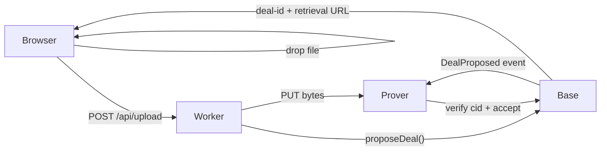

# Web upload

The fastest way to try Prova. Open the upload page, drag a file in, get a `piece-cid` back.

::: tip
**Free tier:** 100 MB per file, 200 MB per IP per 24 hours. We sponsor the storage cost. For larger files, sign up for a free token (1 GiB/day) or bring a wallet.
:::

## Try it

1. Go to [prova.network/upload](https://prova.network/upload/)
2. Drag a file into the drop zone (or click _browse_).
3. Watch the pipeline run:
   * **Compute piece-cid** — your browser hashes the file. The cid is content-addressed; identical files always produce identical cids.
   * **Stage bytes for the prover** — the worker streams your bytes to a Prova prover.
   * **Propose deal on Base** — a storage deal is created on-chain.
   * **Prover accepts and verifies** — the prover fetches, recomputes the cid, posts the first proof.
   * **Active** — the deal is live. The prover will continue posting a proof every 30 seconds.
4. You get back:
   * a **piece-cid** like `baga…q4kr`
   * a **deal-id** like `d-0x9c4f`
   * a **retrieval URL** like `https://prova.network/p/baga…q4kr`

The retrieval URL is permanent for the term of the deal (default 30 days on the free tier). You can share it, embed it, point your ENS contenthash at it.

## What happens behind the scenes

Your file lives on the prover's disk, addressed by its `piece-cid`. The prover signs daily proofs. If a proof is missed, the prover is slashed and the file is re-pinned to a healthy prover automatically.

## When to step up

* **Files > 100 MB** — [sign up](https://prova.network/app/) for a free token (1 GiB/day quota) or [use the CLI](cli.md).
* **Long-term storage (> 30 days)** — bring a Base wallet. Pay in USDC, choose a custom term.
* **Programmatic uploads** — [use the API](../api/upload.md) or [the CLI](cli.md) instead of the browser.

## Limits and caveats

| Limit | Sponsored (no wallet) | Free token (email) | Wallet (paid) |
| --- | --- | --- | --- |
| File size | 100 MB | 5 GiB | unlimited (gas-bounded) |
| Daily quota | 200 MB / IP | 1 GiB / day | quota = your USDC balance |
| Retention | 30 days | 30 days | up to 5 years |
| Slash protection | yes | yes | yes |

The web upload is rate-limited per IP. If you hit the cap, the page tells you. Sign up with an email to lift it.
