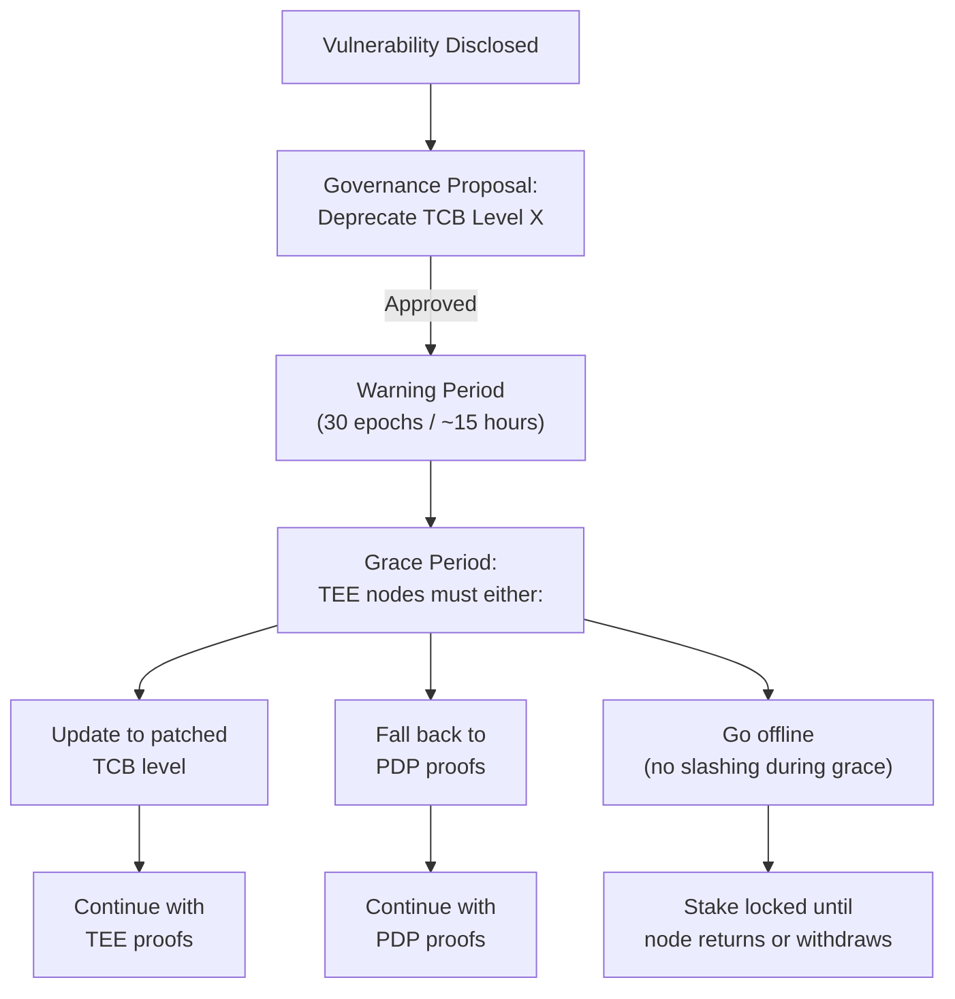

# SPEC-026: TEE-Attested Storage Proofs

**Status:** Draft  
**Author:** Capri  
**Created:** 2026-03-06  
**Inspired by:** Andy Jackson (snadrus) — PoREP-via-TEE design

## 1. Overview

Prova supports an optional fast-path storage proof mechanism using Trusted Execution Environments (TEEs). A TEE-managed disk encryption layer provides hardware-attested proof of storage without the computational cost of PDP Merkle tree construction or PoRep sealing. Combined with Prova's existing PDP and optional PoRep paths, this creates a **three-tier storage proof system** where providers choose the trust model that fits their hardware and economics.

### 1.1 Design Principles

1. **TEE is optional, never required** — PDP remains the universal baseline
2. **Defense in depth** — TEE failures don't compromise the network; PDP path always works
3. **Open source enclave** — TEE images are auditable, reproducible, and chain-versioned
4. **Minimal TCB** — the enclave has disk I/O and bytestream to the host node only; no network access

## 2. Architecture

### 2.1 Trust Model Comparison

| Property | PDP (Baseline) | PoRep (Cold Tier) | TEE (Fast Path) |
|----------|---------------|-------------------|-----------------|
| **Trust assumption** | Math (hash functions) | Math (SNARKs) | Hardware manufacturer |
| **Onboarding time** | Minutes | Hours | Seconds |
| **Verification cost** | O(log N) on-chain | O(1) SNARK verify | Attestation check |
| **Anti-outsourcing** | Probabilistic | Cryptographic | Hardware-enforced |
| **Unique replica** | No (same CommP) | Yes (sealed) | Yes (per-machine encryption) |
| **Special hardware** | None | GPU for sealing | TEE-capable CPU/GPU |
| **Failure mode** | Hash collision (infeasible) | SNARK soundness break | TEE compromise |

### 2.2 System Architecture

```
┌──────────────────────────────────────────────────┐
│                   PROVA NODE                      │
│                                                   │
│  ┌──────────────────────────────────────────────┐│
│  │           TEE ENCLAVE (Isolated)              ││
│  │                                               ││
│  │   ┌──────────┐   ┌────────────────────────┐  ││
│  │   │ Enclave  │   │   Sector Manager       │  ││
│  │   │ Key Store│   │   ├─ Encrypt on write   │  ││
│  │   │          │   │   ├─ Decrypt on read    │  ││
│  │   │ ┌──────┐ │   │   ├─ Chunk verification │  ││
│  │   │ │Master│ │   │   └─ Inline hash check  │  ││
│  │   │ │ Key  │ │   └────────────────────────┘  ││
│  │   │ └──────┘ │                                ││
│  │   └──────────┘                                ││
│  │                                               ││
│  │   I/O BOUNDARY (disk + bytestream only)       ││
│  └──────────────┬───────────────────────────────┘│
│                 │ (sealed channel)                 │
│  ┌──────────────▼───────────────────────────────┐│
│  │           HOST LAYER (Untrusted)              ││
│  │                                               ││
│  │   ┌────────────┐   ┌─────────────────────┐   ││
│  │   │   Prova    │   │   Disk Controller   │   ││
│  │   │   Node     │   │   (raw block I/O)   │   ││
│  │   └────────────┘   └─────────────────────┘   ││
│  └──────────────────────────────────────────────┘│
└──────────────────────────────────────────────────┘
```

**Key constraint:** The enclave has **no network access**. All communication with the outside world flows through the host Prova node via a sealed bytestream channel. This minimizes the attack surface — the enclave cannot be remotely exploited via network protocols.

### 2.3 Enclave Image

The TEE runs a single, open-source, auditable image:

```
ProvaEnclaveImage {
    version:        u32,            // Chain-registered version
    image_hash:     Hash,           // SHA-256 of the enclave binary
    mrenclave:      Hash,           // Intel SGX MRENCLAVE or AMD SEV measurement
    capabilities:   Vec<String>,    // ["storage", "verification"]
    min_tcb_level:  TcbLevel,       // Minimum acceptable TCB (CPU microcode level)
    registered_at:  Epoch,          // When this version was registered on-chain
}
```

The chain maintains a registry of approved enclave images. Only enclaves matching a registered `image_hash` and `mrenclave` are accepted for TEE-attested proofs. **New versions require governance approval** — this is the mechanism for patching TEE vulnerabilities.

## 3. Sector Format

### 3.1 On-Disk Layout

Each sector stored under TEE management has the following structure:

```
┌─────────────────────────────────────────────┐
│ SECTOR HEADER (encrypted with master key)   │
│  ├─ sector_key:    [32 bytes]  AES-256 key  │
│  ├─ sector_nonce:  [12 bytes]  unique nonce  │
│  ├─ sp_id:         [32 bytes]  provider ID   │
│  ├─ sector_id:     u64                       │
│  ├─ version:       u32                       │
│  └─ created_at:    u64         epoch         │
├─────────────────────────────────────────────┤
│ DATA CHUNK 0          [4 KiB encrypted]     │
│ INLINE HASH 0         [32 bytes]            │
├─────────────────────────────────────────────┤
│ DATA CHUNK 1          [4 KiB encrypted]     │
│ INLINE HASH 1         [32 bytes]            │
├─────────────────────────────────────────────┤
│ ...                                         │
├─────────────────────────────────────────────┤
│ DATA CHUNK N          [4 KiB encrypted]     │
│ INLINE HASH N         [32 bytes]            │
├─────────────────────────────────────────────┤
│ SECTOR FOOTER                               │
│  ├─ chunk_count:   u64                      │
│  ├─ root_hash:     [32 bytes]               │
│  └─ hmac:          [32 bytes]               │
└─────────────────────────────────────────────┘
```

**Space overhead:** Each 4 KiB chunk adds 32 bytes of inline hash → **0.78% overhead** (< 1%).

### 3.2 Encryption Hierarchy

```
                    ┌──────────────────┐
                    │  Enclave Master   │
                    │  Key (EMK)        │
                    │  (hardware-bound) │
                    └────────┬─────────┘
                             │ encrypts
                    ┌────────▼─────────┐
                    │  Machine Key File │
                    │  (MKF)           │
                    │  (1 per machine)  │
                    └────────┬─────────┘
                             │ encrypts
              ┌──────────────┼──────────────┐
              ▼              ▼              ▼
        ┌──────────┐  ┌──────────┐  ┌──────────┐
        │ Sector 0 │  │ Sector 1 │  │ Sector N │
        │ Key+Nonce│  │ Key+Nonce│  │ Key+Nonce│
        └──────────┘  └──────────┘  └──────────┘
```

- **Enclave Master Key (EMK):** Derived from the TEE's hardware-sealed storage. Only readable inside the enclave. Unique per physical CPU.
- **Machine Key File (MKF):** Encrypted with EMK. Contains the machine-level key that encrypts individual sector headers. One per machine, portable between enclaves on the same CPU.
- **Sector Key:** Unique per sector. Encrypts the actual data chunks. Stored in the sector header, which is encrypted with the MKF.

**Why this matters for unique replicas:** Because the EMK is unique per physical CPU, the same plaintext data produces different ciphertext on different machines. Block-level deduplication across machines is impossible — every replica is genuinely unique without any SNARK-based sealing.

## 4. Proof Protocol

### 4.1 Registration

When a TEE-equipped provider onboards:

```
1. Enclave boots, performs hardware attestation
2. Enclave generates attestation report:
   {
     mrenclave:     Hash,       // Enclave measurement
     mrsigner:      Hash,       // Signer measurement  
     tcb_level:     TcbLevel,   // CPU microcode + enclave version
     sp_id:         Address,    // Provider's on-chain identity
     public_key:    PubKey,     // Enclave's ephemeral signing key
     timestamp:     u64,
   }
3. Provider submits RegisterTeeNode(attestation_report) to chain
4. Chain verifies:
   - mrenclave matches registered enclave image
   - tcb_level >= minimum required
   - attestation signature chain is valid (Intel/AMD root CA)
5. Node is marked as TEE-capable in the provider registry
```

### 4.2 Sector Onboarding

```
Host Node                      TEE Enclave                    Chain
    │                              │                             │
    ├── raw data ─────────────────>│                             │
    │                              ├── Generate sector_key       │
    │                              ├── Encrypt chunks            │
    │                              ├── Compute inline hashes     │
    │                              ├── Compute root_hash         │
    │                              │                             │
    │<── encrypted sector ─────────┤                             │
    │    + signed commitment       │                             │
    │                              │                             │
    ├── RegisterTeeSector(────────────────────────────────────────>│
    │     sp_id, sector_id,                                      │
    │     root_hash,                                             │
    │     enclave_signature)                                     │
    │                              │                             │
    │                              │     Chain verifies signature │
    │                              │     against registered       │
    │                              │     enclave public key       │
```

**Onboarding time:** Encryption at AES-NI speeds → **seconds for a 32 GiB sector** vs. minutes (PDP) or hours (PoRep).

### 4.3 Proof of Space (Spot Checks)

The chain periodically challenges TEE sectors with random spot checks:

```
Chain                         Host Node                TEE Enclave
  │                              │                         │
  ├── Challenge(sector_id,       │                         │
  │   chunk_indices=[42,1087,    │                         │
  │   5923,12001,30712])────────>│                         │
  │                              ├── Read encrypted ──────>│
  │                              │   chunks from disk      │
  │                              │                         ├── Decrypt chunks
  │                              │                         ├── Verify:
  │                              │                         │   chunk[i] contains
  │                              │                         │   sp_id, sector_id,
  │                              │                         │   chunk_id
  │                              │                         ├── Sign response
  │                              │<── signed proof ────────┤
  │                              │                         │
  │<── SubmitTeeProof(           │                         │
  │     chunk_hashes,            │                         │
  │     enclave_signature)───────┤                         │
  │                              │                         │
  │  Verify signature +          │                         │
  │  chunk_hashes match          │                         │
  │  sector root_hash            │                         │
```

For empty (claimed) space, each 4 KiB chunk contains:
```
FILL_CHUNK = {
    sp_id:      [32 bytes],
    sector_id:  [8 bytes],
    chunk_id:   [8 bytes],
    padding:    [4048 bytes of deterministic fill]
}
```

The enclave verifies these fields match, proving the space is genuinely allocated and not fabricated on-the-fly.

### 4.4 Proof of Used Space (Stored Data)

For sectors containing actual user data, the inline hashes provide verification:

```
Chain selects random chunk indices
TEE decrypts chunks
TEE verifies inline_hash[i] == SHA256(plaintext_chunk[i])
TEE signs attestation: "chunks verified, hashes match"
Chain verifies attestation signature
```

The inline hash scheme means bit flips or data corruption are detectable per-chunk. A storage provider cannot silently lose data — the next verification will catch it.

## 5. Security Analysis

### 5.1 Threat Model

| Threat | Mitigation | Residual Risk |
|--------|-----------|---------------|
| **TEE side-channel attack** (Foreshadow, SGAxe, ÆPIC) | Minimum TCB level enforced on-chain; governance can deprecate vulnerable TCB versions | Non-zero — new attacks discovered every 1-2 years |
| **Enclave key extraction** | EMK is hardware-sealed; extraction requires physical access + sophisticated attack | Low but not zero for state-level adversaries |
| **Malicious enclave image** | Only chain-registered images accepted; open source + governance approval | Supply chain risk in image build pipeline |
| **Replay attack** (old attestation reused) | Attestation includes timestamp + epoch; chain enforces freshness window | Negligible with proper freshness checks |
| **Disk-level manipulation** | Inline hashes catch bit flips; root_hash binds sector integrity | Can't forge without enclave cooperation |
| **SP runs modified host** | Enclave's I/O boundary prevents host interference; host sees only ciphertext | Host can deny service (withhold data) but can't forge proofs |

### 5.2 TEE Deprecation Protocol

When a TEE vulnerability is discovered:



**Critical safety property:** Because PDP is always available as a fallback, a TEE vulnerability **never** compromises the network's storage guarantees. Affected nodes simply fall back to PDP proofs during the grace period. This is the key advantage of TEE-as-optional vs TEE-as-required.

### 5.3 The Defense-in-Depth Argument

No single proof mechanism is perfect:

| Layer | What it proves | What can break it |
|-------|---------------|-------------------|
| **PDP** (math) | Data exists at challenge time | Hash collision (infeasible) |
| **PoRep** (math) | Unique sealed copy exists | SNARK soundness break (infeasible) |
| **TEE** (hardware) | Data encrypted and managed by attested enclave | Hardware side-channel / key extraction |

By supporting all three in a single protocol, Prova achieves **defense in depth**: an attacker must break the specific mechanism a provider is using, and the network can gracefully deprecate any single mechanism if it's compromised.

## 6. Sector Migration

### 6.1 Moving Sectors Between Machines

When a provider migrates sectors to new hardware (different TEE, different EMK):

```
Source Machine                    Destination Machine
TEE Enclave A                     TEE Enclave B
     │                                 │
     ├── Generate transfer_key ────────>│  (secure channel between enclaves)
     ├── Re-encrypt sector headers      │
     │   with transfer_key              │
     │                                  │
     ├── Transfer encrypted sectors ───>│
     │                                  ├── Decrypt with transfer_key
     │                                  ├── Re-encrypt with own MKF
     │                                  ├── Update sector headers
     │                                  └── Sign new attestation
```

The chain must be notified of the migration:
```
MigrateTeeSecors(
    source_enclave:  PubKey_A,
    dest_enclave:    PubKey_B,
    sector_ids:      Vec<u64>,
    dest_attestation: AttestationReport,
)
```

### 6.2 Key Loss Recovery

If a machine's MKF is lost (hardware failure, no backup):

**The data is irrecoverable from the TEE path.** This is by design — it's what prevents attackers from reading the data. However:

1. If the provider stored the original plaintext data, they can re-onboard via PDP or re-encrypt with a new TEE
2. The chain treats key loss as equivalent to sector loss → standard fault/slashing rules apply
3. **Best practice:** Providers should maintain encrypted backups of MKF files, stored separately from the machines they protect

## 7. Dual-Use with Confidential Compute

TEE hardware serves double duty in Prova:

1. **Storage proofs** (this spec) — TEE manages disk encryption for fast onboarding + unique replicas
2. **Confidential inference** ([SPEC-022](./confidential-inference.md)) — TEE executes model inference with encrypted inputs/outputs

A TEE-equipped node that stores model weights under TEE storage proofs can also run confidential inference on those weights — the data never leaves the enclave boundary. This creates a natural synergy:

```
┌─────────────────────────────────────────────┐
│              TEE ENCLAVE                     │
│                                              │
│   ┌──────────────┐   ┌──────────────────┐   │
│   │ Encrypted    │──>│ Inference Engine  │   │
│   │ Model Weights│   │ (INT8 quantized)  │   │
│   └──────────────┘   └──────────┬───────┘   │
│                                 │            │
│   Weights stay inside enclave   │            │
│   at all times — model IP is    │            │
│   protected by hardware         ▼            │
│                          ┌────────────┐      │
│                          │ Encrypted  │      │
│                          │ Output     │      │
│                          └────────────┘      │
└─────────────────────────────────────────────┘
```

## 8. Chain Integration

### 8.1 New State Structures

```rust
struct TeeNodeRegistration {
    provider:       Address,
    enclave_pubkey: PublicKey,
    mrenclave:      Hash,
    tcb_level:      TcbLevel,
    registered_at:  Epoch,
    status:         TeeNodeStatus,  // Active, Deprecated, Suspended
    sector_count:   u64,
}

struct TeeSector {
    provider:       Address,
    sector_id:      u64,
    root_hash:      Hash,
    chunk_count:    u64,
    enclave_pubkey: PublicKey,      // Which enclave manages this sector
    registered_at:  Epoch,
    last_verified:  Epoch,
    data_type:      DataType,       // Empty (space claim) | UserData
}

enum StorageProofType {
    PDP,                // SPEC-004: Merkle inclusion proofs
    PoRep,              // Optional sealed cold tier
    TEE(TeeAttestation), // This spec: hardware-attested
}
```

### 8.2 Verification Gas Costs (Estimated)

| Operation | Gas | Notes |
|-----------|-----|-------|
| RegisterTeeNode | ~200K | Attestation chain verification |
| RegisterTeeSector | ~100K | Signature verification + state update |
| SubmitTeeProof (5 chunks) | ~150K | Signature verify + hash checks |
| MigrateTeeSectors (batch 100) | ~500K | Batch attestation + state updates |
| DeprecateTcbLevel (governance) | ~50K | Registry update |

Comparable to PDP proof costs. The attestation signature verification is the dominant cost.

## 9. Supported TEE Platforms

### 9.1 Initial Support

| Platform | Mechanism | Status |
|----------|-----------|--------|
| **Intel SGX** (v2) | MRENCLAVE, EPID/DCAP attestation | Primary target |
| **Intel TDX** | Trust Domain, DCAP attestation | Planned |
| **AMD SEV-SNP** | VM measurement, versioned TCB | Planned |

### 9.2 Platform Abstraction

The enclave image and attestation verification are abstracted behind a platform interface:

```rust
trait TeeBackend {
    fn attest(&self, sp_id: Address) -> AttestationReport;
    fn verify_attestation(report: &AttestationReport) -> Result<TeeIdentity>;
    fn seal(&self, data: &[u8]) -> Vec<u8>;      // Encrypt with EMK
    fn unseal(&self, data: &[u8]) -> Vec<u8>;     // Decrypt with EMK
}
```

New TEE platforms can be added by implementing this trait and registering the platform's root CA certificates on-chain.

## 10. Comparison to Pure TEE Approaches

Some designs propose TEE as the **only** proof mechanism. Prova explicitly rejects this:

| Design | Prova (TEE optional) | TEE-only |
|--------|---------------------|----------|
| TEE compromised | Network falls back to PDP — no disruption | **Network security breaks entirely** |
| No TEE hardware | Full participation via PDP | **Cannot participate** |
| Verification | TEE attestation OR math proofs | TEE attestation only |
| Trust diversification | Hardware + math + economics | Hardware only |
| Hardware vendor risk | Diversified across Intel/AMD/math | Single manufacturer dependency |

**Prova's position:** TEE is an excellent optimization for fast onboarding and unique replicas, but it must never be a requirement. The network's security must be grounded in mathematics (PDP/PoRep), with TEE as an acceleration layer.

## 11. References

- [SPEC-004: PDP Integration](./pdp-integration.md)
- [SPEC-022: Confidential Inference](./confidential-inference.md)
- [Intel SGX Developer Reference](https://software.intel.com/content/www/us/en/develop/topics/software-guard-extensions.html)
- [AMD SEV-SNP Whitepaper](https://www.amd.com/system/files/TechDocs/SEV-SNP-strengthening-vm-isolation-with-integrity-protection-and-more.pdf)
- Andy Jackson (snadrus) — "PoREP: Could it really be this easy?" (internal design doc, 2026)
- Prova Whitepaper §3.2 (Storage Layer)
